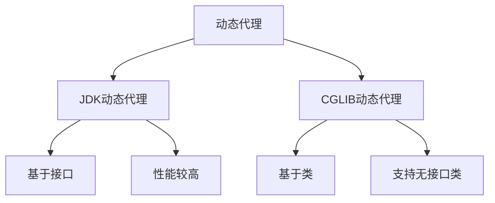
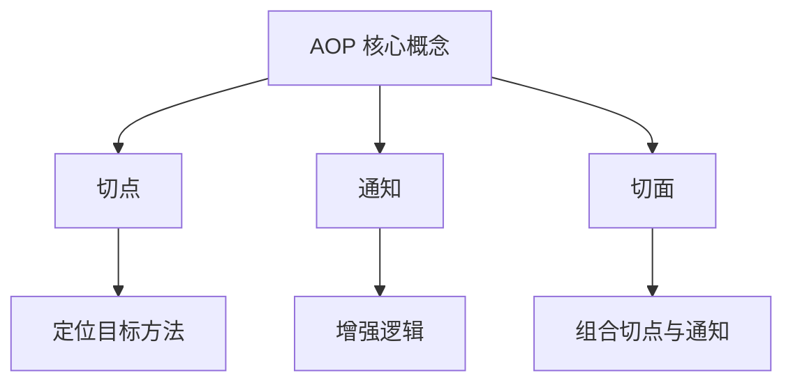
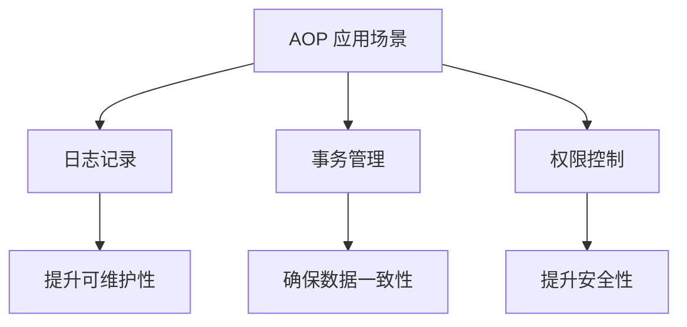

### AOP（面向切面编程）
------
#### **1. 动态代理：JDK动态代理 vs. CGLIB**
**🔑 知识点详解**
- **动态代理的定义**：
  - **定义**：动态代理是一种在运行时动态创建代理对象的技术，用于增强目标对象的功能。
  - **核心思想**：通过代理对象拦截方法调用，执行额外逻辑（如日志记录、事务管理）。
    👉 **注意**：Spring AOP 默认使用动态代理实现切面功能。

- **JDK动态代理**：
  - **定义**：基于接口的动态代理技术，要求目标对象实现至少一个接口。
  - **核心思想**：通过 `java.lang.reflect.Proxy` 创建代理对象，代理接口的方法调用。
    👉 **注意**：JDK动态代理只能代理接口方法，无法直接代理类。

- **CGLIB动态代理**：
  - **定义**：基于类的动态代理技术，通过生成目标类的子类实现代理。
  - **核心思想**：通过字节码操作库（如 ASM）动态生成目标类的子类，并重写其方法。
    👉 **注意**：CGLIB 可以代理没有实现接口的类，但无法代理 `final` 方法。

**🔥 面试高频题**
1. JDK动态代理和CGLIB的区别是什么？
   - **一句话答案**：JDK动态代理基于接口，CGLIB基于类。
   - **深入回答**：JDK动态代理和CGLIB是两种常见的动态代理技术，它们的主要区别如下：
     - **JDK动态代理**：
       - 基于接口，要求目标对象实现至少一个接口。
       - 使用 `java.lang.reflect.Proxy` 创建代理对象。
       - 性能较高，适合代理接口方法。
     - **CGLIB动态代理**：
       - 基于类，通过生成目标类的子类实现代理。
       - 使用字节码操作库（如 ASM）动态生成子类。
       - 性能略低，但可以代理没有实现接口的类。
       在 Spring AOP 中，默认优先使用 JDK动态代理；如果目标对象未实现接口，则使用 CGLIB。

2. 如何选择JDK动态代理或CGLIB？
   - **一句话答案**：根据目标对象是否实现接口选择代理方式。
   - **深入回答**：选择动态代理方式时需要考虑以下因素：
     - 如果目标对象实现了接口，优先使用 JDK动态代理，因为它性能更高且更稳定。
     - 如果目标对象未实现接口，必须使用 CGLIB。
     - 如果需要代理 `final` 方法，则无法使用 CGLIB，需重新设计代码。
     ```java
     // JDK动态代理示例
     public interface UserService {
         void addUser(String username);
     }
     
     public class UserServiceImpl implements UserService {
         @Override
         public void addUser(String username) {
             System.out.println("Adding user: " + username);
         }
     }
     
     public class JdkProxyHandler implements InvocationHandler {
         private Object target;
     
         public JdkProxyHandler(Object target) {
             this.target = target;
         }
     
         @Override
         public Object invoke(Object proxy, Method method, Object[] args) throws Throwable {
             System.out.println("Before method: " + method.getName());
             Object result = method.invoke(target, args);
             System.out.println("After method: " + method.getName());
             return result;
         }
     }
     
     UserService userService = new UserServiceImpl();
     UserService proxy = (UserService) Proxy.newProxyInstance(
         userService.getClass().getClassLoader(),
         userService.getClass().getInterfaces(),
         new JdkProxyHandler(userService)
     );
     proxy.addUser("Alice");
     ```

**🌟 重点提醒**
- **要点一**：JDK动态代理基于接口，CGLIB基于类。
- **要点二**：Spring AOP 默认优先使用 JDK动态代理。
- **要点三**：CGLIB 无法代理 `final` 方法。

**📝 实践经验**
```java
// CGLIB动态代理示例
public class OrderService {
    public void placeOrder() {
        System.out.println("Placing order...");
    }
}

public class CglibProxyInterceptor implements MethodInterceptor {
    @Override
    public Object intercept(Object obj, Method method, Object[] args, MethodProxy proxy) throws Throwable {
        System.out.println("Before method: " + method.getName());
        Object result = proxy.invokeSuper(obj, args);
        System.out.println("After method: " + method.getName());
        return result;
    }
}

Enhancer enhancer = new Enhancer();
enhancer.setSuperclass(OrderService.class);
enhancer.setCallback(new CglibProxyInterceptor());
OrderService proxy = (OrderService) enhancer.create();
proxy.placeOrder();
```

**🔧 工具辅助**


------
#### **2. 核心概念：切点、通知、切面**
**🔑 知识点详解**
- **切点（`@Pointcut`）**：
  - **定义**：切点定义了切面应用的目标方法集合，通常通过表达式指定。
  - **核心思想**：通过切点定位需要增强的方法。
    👉 **注意**：切点表达式支持通配符和逻辑运算符。

- **通知（`@Before`/`@After`/`@Around`）**：
  - **定义**：通知定义了在切点处执行的增强逻辑。
  - **核心思想**：不同类型的通知适用于不同的场景：
    - **`@Before`**：在目标方法执行前执行。
    - **`@After`**：在目标方法执行后执行（无论成功或异常）。
    - **`@Around`**：环绕目标方法执行，可控制方法的执行流程。
    👉 **注意**：`@Around` 是最强大的通知类型，但需谨慎使用。

- **切面（`@Aspect`）**：
  - **定义**：切面是切点和通知的组合，封装了横切关注点。
  - **核心思想**：通过切面将横切逻辑与业务逻辑分离。
    👉 **注意**：切面是 AOP 的核心组件。

**🔥 面试高频题**
1. 切点、通知和切面的关系是什么？
   - **一句话答案**：切点定义目标方法，通知定义增强逻辑，切面将两者组合。
   - **深入回答**：切点、通知和切面是 AOP 的核心概念，它们的关系如下：
     - **切点**：通过表达式定位目标方法集合。
     - **通知**：定义在切点处执行的增强逻辑，包括 `@Before`、`@After` 和 `@Around`。
     - **切面**：将切点和通知组合在一起，封装横切关注点。例如：
       ```java
       @Aspect
       @Component
       public class LoggingAspect {
           @Pointcut("execution(* com.example.service.*.*(..))")
           public void serviceMethods() {}
       
           @Before("serviceMethods()")
           public void logBefore(JoinPoint joinPoint) {
               System.out.println("Before method: " + joinPoint.getSignature().getName());
           }
       
           @After("serviceMethods()")
           public void logAfter(JoinPoint joinPoint) {
               System.out.println("After method: " + joinPoint.getSignature().getName());
           }
       
           @Around("serviceMethods()")
           public Object logAround(ProceedingJoinPoint joinPoint) throws Throwable {
               System.out.println("Around before: " + joinPoint.getSignature().getName());
               Object result = joinPoint.proceed();
               System.out.println("Around after: " + joinPoint.getSignature().getName());
               return result;
           }
       }
       ```

2. 如何编写一个切面实现日志记录？
   - **一句话答案**：通过切点定位目标方法，结合通知实现日志逻辑。
   - **深入回答**：编写切面实现日志记录的基本步骤包括：
     1. 定义切点，指定需要增强的方法集合。
     2. 编写通知，在目标方法执行前后记录日志。
     3. 将切点和通知组合为切面。例如：
       ```java
       @Aspect
       @Component
       public class LoggingAspect {
           @Pointcut("execution(* com.example.service.*.*(..))")
           public void serviceMethods() {}
     
           @Before("serviceMethods()")
           public void logBefore(JoinPoint joinPoint) {
               System.out.println("Executing method: " + joinPoint.getSignature().getName());
           }
       }
       ```

**🌟 重点提醒**
- **要点一**：切点定义目标方法，通知定义增强逻辑。
- **要点二**：切面是切点和通知的组合。
- **要点三**：不同类型的通知适用于不同场景。

**📝 实践经验**
```java
@Aspect
@Component
public class TransactionAspect {
    @Pointcut("execution(* com.example.service.*.*(..))")
    public void serviceMethods() {}

    @Around("serviceMethods()")
    public Object manageTransaction(ProceedingJoinPoint joinPoint) throws Throwable {
        System.out.println("Starting transaction...");
        try {
            Object result = joinPoint.proceed();
            System.out.println("Committing transaction...");
            return result;
        } catch (Exception e) {
            System.out.println("Rolling back transaction...");
            throw e;
        }
    }
}
```

**🔧 工具辅助**


------
#### **3. 应用场景：日志、事务、权限控制**
**🔑 知识点详解**
- **日志记录**：
  - **定义**：通过切面记录方法的执行信息（如方法名、参数、返回值）。
  - **核心思想**：将日志逻辑与业务逻辑分离，提升代码的可维护性。
    👉 **注意**：日志记录通常使用 `@Before` 和 `@After` 通知。

- **事务管理**：
  - **定义**：通过切面管理数据库事务的开启、提交和回滚。
  - **核心思想**：将事务逻辑与业务逻辑分离，确保数据一致性。
    👉 **注意**：事务管理通常使用 `@Around` 通知。

- **权限控制**：
  - **定义**：通过切面检查用户权限，限制对敏感方法的访问。
  - **核心思想**：将权限逻辑与业务逻辑分离，提升安全性。
    👉 **注意**：权限控制通常使用 `@Before` 通知。

**🔥 面试高频题**
1. AOP 在实际项目中的应用场景有哪些？
   - **一句话答案**：AOP 常用于日志记录、事务管理和权限控制等横切关注点。
   - **深入回答**：AOP 的主要应用场景包括：
     - **日志记录**：通过切面记录方法的执行信息，便于调试和监控。
     - **事务管理**：通过切面管理数据库事务，确保数据一致性。
     - **权限控制**：通过切面检查用户权限，限制对敏感方法的访问。
     - **性能监控**：通过切面记录方法的执行时间，分析性能瓶颈。
     例如：
     ```java
     @Aspect
     @Component
     public class PermissionAspect {
         @Before("execution(* com.example.service.AdminService.*(..))")
         public void checkPermission() {
             Authentication auth = SecurityContextHolder.getContext().getAuthentication();
             if (!auth.getAuthorities().contains(new SimpleGrantedAuthority("ROLE_ADMIN"))) {
                 throw new AccessDeniedException("Access denied");
             }
         }
     }
     ```

2. 如何通过 AOP 实现事务管理？
   - **一句话答案**：通过 `@Around` 通知控制事务的开启、提交和回滚。
   - **深入回答**：实现事务管理的基本步骤包括：
     1. 定义切点，指定需要管理事务的方法集合。
     2. 编写 `@Around` 通知，在方法执行前后管理事务。
     3. 捕获异常并回滚事务。例如：
       ```java
       @Aspect
       @Component
       public class TransactionAspect {
           @Around("execution(* com.example.service.*.*(..))")
           public Object manageTransaction(ProceedingJoinPoint joinPoint) throws Throwable {
               System.out.println("Starting transaction...");
               try {
                   Object result = joinPoint.proceed();
                   System.out.println("Committing transaction...");
                   return result;
               } catch (Exception e) {
                   System.out.println("Rolling back transaction...");
                   throw e;
               }
           }
       }
       ```

**🌟 重点提醒**
- **要点一**：AOP 常用于日志记录、事务管理和权限控制。
- **要点二**：不同类型的通知适用于不同场景。
- **要点三**：通过切面将横切逻辑与业务逻辑分离。

**📝 实践经验**
```java
@Aspect
@Component
public class LoggingAspect {
    @Before("execution(* com.example.service.*.*(..))")
    public void logBefore(JoinPoint joinPoint) {
        System.out.println("Executing method: " + joinPoint.getSignature().getName());
    }

    @After("execution(* com.example.service.*.*(..))")
    public void logAfter(JoinPoint joinPoint) {
        System.out.println("Finished method: " + joinPoint.getSignature().getName());
    }
}
```

**🔧 工具辅助**


------
#### **💡 复习建议**
1. 掌握动态代理的两种实现方式及其适用场景。
2. 理解切点、通知和切面的核心概念及其关系。
3. 学习 AOP 的常见应用场景（如日志、事务、权限控制）。
4. 结合实际项目案例，理解 AOP 的优势和实现方式。