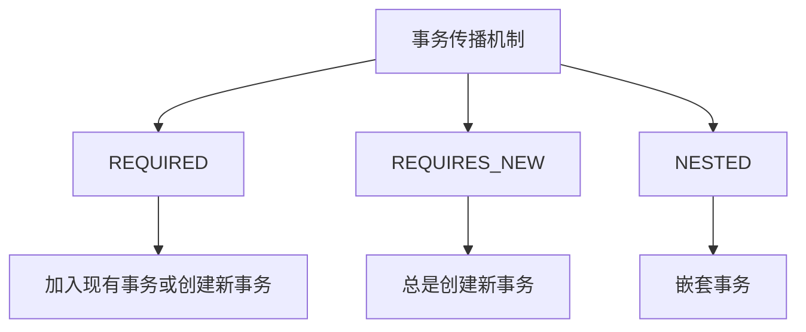
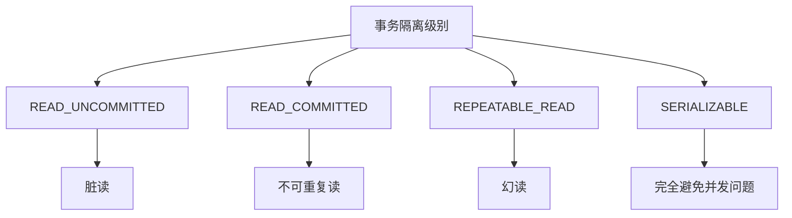
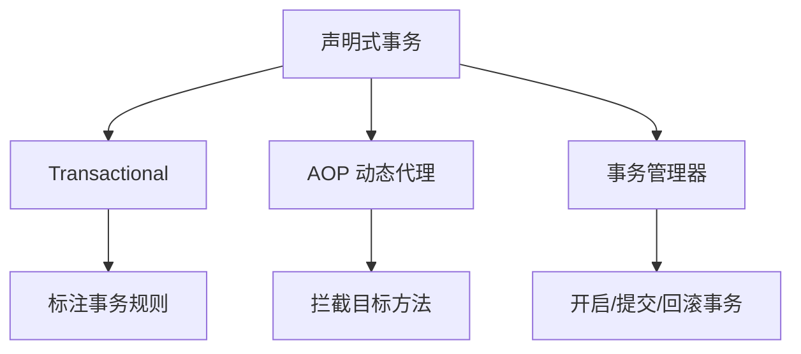

### 事务管理
------
#### **1. 事务传播机制**
**🔑 知识点详解**
- **事务传播机制的定义**：
  - **定义**：事务传播机制定义了多个事务方法调用时事务的行为，决定了新事务是否创建或现有事务是否复用。
  - **核心思想**：通过传播行为控制事务的边界，确保数据一致性和并发性。
    👉 **注意**：Spring 提供了多种事务传播行为，适用于不同场景。

- **常见事务传播行为**：
  - **`REQUIRED`（默认）**：
    - **定义**：如果当前存在事务，则加入该事务；否则创建一个新事务。
    - **适用场景**：大多数业务逻辑场景。
  - **`REQUIRES_NEW`**：
    - **定义**：无论当前是否存在事务，都创建一个新事务，并挂起当前事务（如果有）。
    - **适用场景**：需要独立事务的场景（如日志记录、审计）。
  - **`NESTED`**：
    - **定义**：如果当前存在事务，则在嵌套事务中执行；否则创建一个新事务。
    - **适用场景**：需要部分回滚的场景（如保存点机制）。

**🔥 面试高频题**
1. `REQUIRED` 和 `REQUIRES_NEW` 的区别是什么？
   - **一句话答案**：`REQUIRED` 加入现有事务或创建新事务，`REQUIRES_NEW` 总是创建新事务并挂起现有事务。
   - **深入回答**：`REQUIRED` 和 `REQUIRES_NEW` 是两种常见的事务传播行为，它们的主要区别如下：
     - **`REQUIRED`**：
       - 如果当前存在事务，则加入该事务。
       - 如果当前不存在事务，则创建一个新事务。
       - 适合大多数业务逻辑场景，确保事务的一致性。
     - **`REQUIRES_NEW`**：
       - 无论当前是否存在事务，都创建一个新事务。
       - 如果当前存在事务，则挂起该事务，直到新事务完成。
       - 适合需要独立事务的场景（如日志记录、审计），避免事务间的相互影响。
     ```java
     @Transactional(propagation = Propagation.REQUIRED)
     public void methodA() {
         // 加入现有事务或创建新事务
     }
     
     @Transactional(propagation = Propagation.REQUIRES_NEW)
     public void methodB() {
         // 总是创建新事务
     }
     ```

2. 如何选择合适的事务传播行为？
   - **一句话答案**：根据业务需求和事务边界选择传播行为。
   - **深入回答**：选择事务传播行为时需要考虑以下因素：
     - **`REQUIRED`**：适合大多数业务逻辑场景，确保事务一致性。
     - **`REQUIRES_NEW`**：适合需要独立事务的场景（如日志记录、审计）。
     - **`NESTED`**：适合需要部分回滚的场景（如保存点机制）。
     - **性能与隔离性**：`REQUIRES_NEW` 和 `NESTED` 可能带来额外的性能开销，需权衡使用。

**🌟 重点提醒**
- **要点一**：`REQUIRED` 是默认传播行为，适合大多数场景。
- **要点二**：`REQUIRES_NEW` 总是创建新事务，适合独立事务场景。
- **要点三**：`NESTED` 支持部分回滚，适合复杂事务场景。

**📝 实践经验**
```java
@Service
public class TransactionService {
    @Transactional(propagation = Propagation.REQUIRED)
    public void outerMethod() {
        innerMethod();
    }

    @Transactional(propagation = Propagation.REQUIRES_NEW)
    public void innerMethod() {
        // 独立事务
    }
}
```

**🔧 工具辅助**


------
#### **2. 事务隔离级别**
**🔑 知识点详解**
- **事务隔离级别的定义**：
  - **定义**：事务隔离级别定义了事务之间的可见性和并发性，用于解决并发问题（如脏读、不可重复读、幻读）。
  - **核心思想**：通过不同的隔离级别平衡数据一致性和性能。
    👉 **注意**：隔离级别越高，数据一致性越强，但性能开销越大。

- **常见事务隔离级别**：
  - **读未提交（`READ_UNCOMMITTED`）**：
    - **定义**：允许读取未提交的数据，可能导致脏读。
    - **适用场景**：对数据一致性要求较低的场景。
  - **读已提交（`READ_COMMITTED`，默认）**：
    - **定义**：只能读取已提交的数据，避免脏读，但可能出现不可重复读。
    - **适用场景**：大多数业务逻辑场景。
  - **可重复读（`REPEATABLE_READ`）**：
    - **定义**：确保同一事务内多次读取结果一致，避免不可重复读，但可能出现幻读。
    - **适用场景**：对数据一致性要求较高的场景。
  - **串行化（`SERIALIZABLE`）**：
    - **定义**：最高隔离级别，完全避免并发问题，但性能开销最大。
    - **适用场景**：对数据一致性要求极高的场景。

**🔥 面试高频题**
1. 常见事务隔离级别有哪些？如何选择合适的隔离级别？
   - **一句话答案**：常见隔离级别包括读未提交、读已提交、可重复读和串行化，选择时需权衡一致性和性能。
   - **深入回答**：事务隔离级别的主要类型及其特点如下：
     - **读未提交（`READ_UNCOMMITTED`）**：
       - 允许读取未提交的数据，可能导致脏读。
       - 适合对数据一致性要求较低的场景。
     - **读已提交（`READ_COMMITTED`，默认）**：
       - 只能读取已提交的数据，避免脏读，但可能出现不可重复读。
       - 适合大多数业务逻辑场景。
     - **可重复读（`REPEATABLE_READ`）**：
       - 确保同一事务内多次读取结果一致，避免不可重复读，但可能出现幻读。
       - 适合对数据一致性要求较高的场景。
     - **串行化（`SERIALIZABLE`）**：
       - 最高隔离级别，完全避免并发问题，但性能开销最大。
       - 适合对数据一致性要求极高的场景。
       在实际项目中，通常选择 `READ_COMMITTED` 或 `REPEATABLE_READ`，并在必要时优化性能。

2. 如何解决脏读、不可重复读和幻读问题？
   - **一句话答案**：通过提高事务隔离级别解决并发问题。
   - **深入回答**：并发问题及其解决方案如下：
     - **脏读**：通过 `READ_COMMITTED` 或更高隔离级别解决。
     - **不可重复读**：通过 `REPEATABLE_READ` 或更高隔离级别解决。
     - **幻读**：通过 `SERIALIZABLE` 解决。
     例如：
     ```java
     @Transactional(isolation = Isolation.REPEATABLE_READ)
     public void criticalOperation() {
         // 确保数据一致性
     }
     ```

**🌟 重点提醒**
- **要点一**：隔离级别越高，数据一致性越强，但性能开销越大。
- **要点二**：`READ_COMMITTED` 是默认隔离级别，适合大多数场景。
- **要点三**：通过提高隔离级别解决并发问题。

**📝 实践经验**
```java
@Transactional(isolation = Isolation.REPEATABLE_READ)
public void performTransaction() {
    // 确保同一事务内多次读取结果一致
}
```

**🔧 工具辅助**


------
#### **3. 声明式事务：`@Transactional` 注解实现原理（基于 AOP）**
**🔑 知识点详解**
- **声明式事务的定义**：
  - **定义**：声明式事务是一种通过注解或配置文件声明事务规则的方式，无需手动管理事务。
  - **核心思想**：通过 AOP 动态代理实现事务管理，将事务逻辑与业务逻辑分离。
    👉 **注意**：`@Transactional` 是 Spring 中声明式事务的核心注解。

- **`@Transactional` 的实现原理**：
  - **定义**：`@Transactional` 通过 AOP 动态代理拦截目标方法，在方法执行前后管理事务。
  - **核心思想**：通过动态代理生成代理对象，结合事务管理器（如 `DataSourceTransactionManager`）实现事务的开启、提交和回滚。
    👉 **注意**：`@Transactional` 默认基于 JDK 动态代理，若目标类未实现接口，则使用 CGLIB。

**🔥 面试高频题**
1. `@Transactional` 的工作原理是什么？
   - **一句话答案**：`@Transactional` 通过 AOP 动态代理拦截目标方法，结合事务管理器实现事务管理。
   - **深入回答**：`@Transactional` 的核心原理如下：
     1. **切面拦截**：Spring 使用 AOP 切面拦截标注了 `@Transactional` 的方法。
     2. **动态代理**：通过 JDK 动态代理或 CGLIB 创建代理对象。
     3. **事务管理**：在方法执行前后，代理对象通过事务管理器（如 `DataSourceTransactionManager`）管理事务的开启、提交和回滚。
     4. **异常处理**：如果方法抛出未捕获的运行时异常或错误，默认回滚事务；否则提交事务。
     ```java
     @Service
     public class UserService {
         @Transactional
         public void addUser(String username) {
             // 业务逻辑
         }
     }
     ```

2. 如何自定义事务管理规则？
   - **一句话答案**：通过配置事务管理器和自定义注解实现事务规则。
   - **深入回答**：自定义事务管理规则的基本步骤包括：
     1. 配置事务管理器（如 `DataSourceTransactionManager`）。
     2. 自定义注解（如 `@CustomTransactional`）。
     3. 编写切面拦截自定义注解，结合事务管理器实现事务管理。例如：
       ```java
       @Target(ElementType.METHOD)
       @Retention(RetentionPolicy.RUNTIME)
       public @interface CustomTransactional {}
     
       @Aspect
       @Component
       public class CustomTransactionAspect {
           @Around("@annotation(CustomTransactional)")
           public Object manageTransaction(ProceedingJoinPoint joinPoint) throws Throwable {
               System.out.println("Starting transaction...");
               try {
                   Object result = joinPoint.proceed();
                   System.out.println("Committing transaction...");
                   return result;
               } catch (Exception e) {
                   System.out.println("Rolling back transaction...");
                   throw e;
               }
           }
       }
       ```

**🌟 重点提醒**
- **要点一**：`@Transactional` 通过 AOP 动态代理实现事务管理。
- **要点二**：事务管理器负责事务的开启、提交和回滚。
- **要点三**：自定义事务规则可通过切面实现。

**📝 实践经验**
```java
@Configuration
@EnableTransactionManagement
public class TransactionConfig {
    @Bean
    public DataSourceTransactionManager transactionManager(DataSource dataSource) {
        return new DataSourceTransactionManager(dataSource);
    }
}

@Service
public class OrderService {
    @Transactional
    public void placeOrder() {
        // 事务逻辑
    }
}
```

**🔧 工具辅助**


------
#### **💡 复习建议**
1. 掌握事务传播机制的核心概念及其适用场景。
2. 理解事务隔离级别的特点及其对并发问题的影响。
3. 学习 `@Transactional` 的实现原理，理解其基于 AOP 的工作机制。
4. 结合实际项目案例，掌握事务管理的最佳实践。